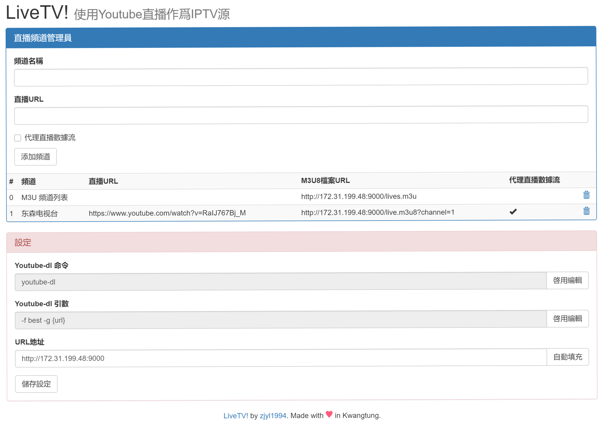

# LiveTV
将 Youtube 直播作为 IPTV 电视源

## 安装方法

首先你需要安裝Docker，Centos7用家可以直接使用參考這篇教學文檔：[How To Install and Use Docker on CentOS 7](https://www.digitalocean.com/community/tutorials/how-to-install-and-use-docker-on-centos-7)

安裝好Docker后，只需要使用以下命令即可在本地的9500連接埠啓用LiveTV!

`docker run -d -p9500:9000 zjyl1994/livetv:1.0`

資料檔存儲于容器内的 `/root/data` 目錄中，所以建議使用-v指令將這個目錄映射到宿主機的目錄。

一個使用外部儲存目錄的例子如下。

`docker run -d -p9500:9000 -v/mnt/data/livetv:/root/data zjyl1994/livetv:1.1`

這將在 9500 連接埠開啓一個使用 `/mnt/data/livetv` 目錄作爲存儲的 LiveTV！ 容器。

PS: 如果不指定外部存儲目錄，LiveTV！重新啓動時將無法讀取之前的設定檔。

## 使用方法

默認的登入密碼是 "password",爲了你的安全請及時修改。

首先你要知道如何在外界訪問到你的主機，如果你使用 VPS 或者獨立伺服器，可以訪問 `http://你的主機ip:9500`，你應該可以看到以下畫面：

首先你需要在設定區域點擊“自動填充”，設定正確的URL。然後點擊“儲存設定”。

然後就可以添加頻道，頻道添加成功后就能M3U8檔案列的地址進行播放了。

當你使用Kodi之類的播放器，可以考慮使用第一行的M3U檔案URL進行播放，會自動生成包含所有頻道信息的播放列表。

Youtube-dl的文檔可以在這裏找到 => [https://github.com/ytdl-org/youtube-dl](https://github.com/ytdl-org/youtube-dl)